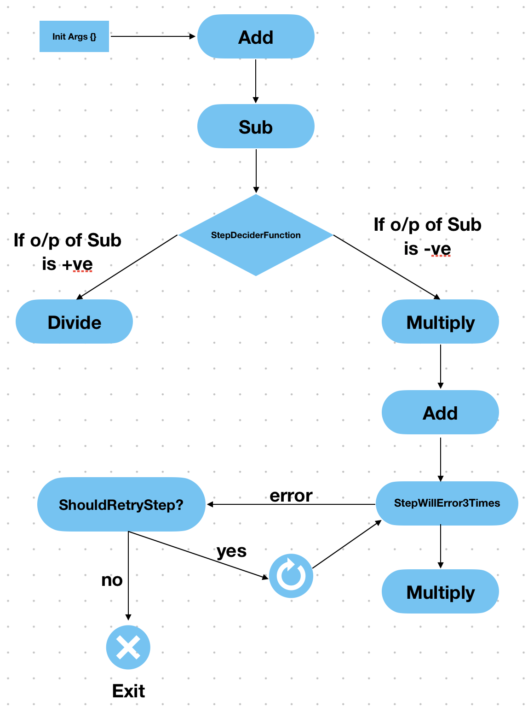

# GoSteps

GoSteps is a go library that helps in running functions as steps and reminds you to step out and get active (kidding!). 

<p align="center">
 
</p>

The idea behind `gosteps` is to define set of functions as steps-chain (kind of a linked list) and execute them in a sequential fashion by piping output (other than error) from previous step, as arguments, into the next steps (not necessarily using the args).

## Usage

The `Step` type contains the requirments to execute a step function and move to next one.

```go
type Step struct {
	Name              StepName
	Function          StepFn
	UseArguments      stepArgChainingType
	StepArgs          []interface{}
	NextStep          *Step
	PossibleNextSteps PossibleNextSteps
	NextStepResolver  interface{}
	ErrorsToRetry     []error
	StrictErrorCheck  bool
	SkipRetry         bool
	MaxAttempts       int
	RetrySleep        time.Duration
}

```

| Field             | Description                                                                                                                  |
|-------------------|------------------------------------------------------------------------------------------------------------------------------|
| Name              | Name of step                                                                                                                 |
| Function          | The function to execute                                                                                                      |
| StepArgs          | any additional arguments need to pass to te step                                                                             |
| UseArguments      | Choosing Arguments to Use from previous step's return or current step's arguments or both.                                   |
| NextStep          | Next Step for the current step. If next step needs to be conditional dont set this and use `PossibleNextSteps` field instead |
| PossibleNextSteps | Candidate functions for next step (pick from multiple possible next steps based on condition)                                |
| NextStepResolver  | A function that returns the step name, based on conditions, that is used to pick the NextStep from PossibleNextSteps         |
| ErrorsToRetry     | A list of error to retry step for                                                                                            |
| StrictErrorCheck  | If set to `true` exact error is matched, else only presence of error is checked                                              |
| SkipRetry         | If set to `true` step is not retried for any error                                                                           |
| MaxAttempts       | Max attempts are the number of times the step is tried (first try + subsequent retries). If not set, it'll run 100 times     |
| RetrySleep        | Sleep duration (type time.Duration) between each re-attempts                                                                 |                                                                |

### Step Function

Define a step function using the following function signature. You can also use the  `StepFn` type.

```go
// StepFn Type
type StepFn func(...interface{}) ([]interface{}, error)

// sample Step function
func Add(args ...any) ([]interface{}, error) {
	fmt.Printf("Adding %v\n", args)
	return []interface{}{args[0].(int) + args[1].(int)}, nil
}
```

To see all the `types` available in go-steps see [`types.go`](./go_step_types.go)

### Defining Steps

To define steps, use the `gosteps.Step` type and link the next steps in the `NextStep` field like a Linked List.

```go
var steps = gosteps.Step{
	Name: "add",
	Function: funcs.Add,
	StepArgs: []interface{}{2, 3},
	NextStep: gosteps.Steps{
		Name: "sub",
		Function:       funcs.Sub,
		StepArgs: []interface{}{4},
	},
}
```

Here the first step is `Add` and next step (and final) is `Sub`, so the output of Add is piped to Sub and that gives the final output.

### Choosing Arguments to Use

Arguments to use in the current step function's execution is determined using the previous step returned values and the current step arguments specified. 

You can choose if you want to use previous step returned values as arguments to current step, or you want to use only current step arguments or both. You can also choose the order in which the returns from previous step, and step arguments are passed as arguments. 

This can be done so by passing the "strategy" to the `UseArguments` field. There are four directives defined in the library

```go
 // only previous step return will be passed to current step as arguments
 PreviousStepReturns stepArgChainingType = "PreviousStepReturns"

 // only current step arguments (StepArgs) will be passed to current step as arguments
 CurrentStepArgs stepArgChainingType = "CurrentStepArgs"

 // both previous step returns and current step arguments (StepArgs) will be passed
 // to current step as arguments - previous step returns, followed by current step args,
 PreviousReturnsWithCurrentStepArgs stepArgChainingType = "PreviousReturnsWithCurrentStepArgs"

 // both previous step returns and current step arguments (StepArgs) will be passed
 // to current step as arguments - current step args, followed by previous step returns
 CurrentStepArgsWithPreviousReturns stepArgChainingType = "CurrentStepArgsWithPreviousReturns"
```

These values can be used in the step chain as
```go
var steps = gosteps.Step{
	Name: "add",
	Function: funcs.Add,
	StepArgs: []interface{}{2, 3},
	NextStep: gosteps.Steps{
		Name: "sub",
		Function:       funcs.Sub,
		StepArgs: []interface{}{4, 6},
		UseArguments: gosteps.CurrentStepArgs,
	},
}
```

### Conditional Steps

Some steps might have multiple candidates for next step and the executable next step is to be picked based on the output of the current step. Define the possible next steps in the `PossibleNextSteps` field, as an array of Steps.

```go
PossibleNextSteps: gosteps.Step{
	Function:       funcs.Add,
		StepArgs: []interface{}{2},
		NextStep: &gosteps.Step{
			Function:         funcs.Sub,
			StepArgs:   []interface{}{4},
			NextStepResolver: nextStepResolver,
			PossibleNextSteps: gosteps.PossibleNextSteps{
				{
					Name:           "multiply",
					Function:       funcs.Multiply,
				},
				{
				Name:           "divide",
					Function:       funcs.Divide,
				},
			}
	}
}
```

To pick the required next step based on conditions, we must use the `NextStepResolver` field passing a resolver function that returns the Name of the function to use as next step.

The resolver function should be of type `func(args ...any) string`, where `args` are the output of current step and returned string is the name of the step to use.

```go
func nextStepResolver(args ...any) string {
	if args[0].(int) < 5 {
		fmt.Printf("StepResolver [%v]: Arguments is Negative, going with Multiply\n", args)
		return "add"
	}

	fmt.Printf("StepResolver [%v]: Arguments is Positive, going with Divide\n", args)
	return "sub"
}
```

### Executing Steps

To execute steps use the `Execute(initArgs ...any)` method, passing the (optional) initializing arguments.

```go
import (
	gosteps "github.com/TanmoySG/go-steps"
	funcs "github.com/TanmoySG/go-steps/example/funcs"
)

func main() {
	initArgs := []interface{}{1, 2}
	finalOutput, err := steps.Execute(initArgs...)
	if err != nil {
		fmt.Printf("error executing steps: %s, final output: [%s]\n", err, finalOutput)
	}

	fmt.Printf("Final Output: [%v]\n", finalOutput)
}
```

### Retrying for Error

To retry a step for particular erors, use the `ErrorsToRetry` field passing the list of errors. To make sure the error matches exactly as that of the Errors to retry, pass `true` for the `StrictErrorCheck` field, otherwise only error-substring presense will be checked.

```go
{
	ErrorsToRetry: []error{
		fmt.Errorf("error to retry"),
	},
	StrictErrorCheck: true,
	MaxAttempts: 5,
	RetrySleep:  1 * time.Second,
}
```

To skip retry on error pass `true` to the `SkipRetry` field.

Additionally,

- To limit the number of tries, use the `MaxAttempts` field, passing the number of max tries. If not set then Default Max Attempts (of 100 tries) is used. To avoid infinite runs due to the MaxAttempts not being set, we're keeping the default attempts to 100. If required, import and use the `gosteps.MaxMaxAttempts`. Please note that the Max value is `9223372036854775807`, which is not infinite but a huge number of attempts, please use cautiously.
- To add sleep between each attempts, use the `RetrySleep` parameter passing the duration of sleep (of type time.Duration) like `2 * time.Second`.

## Constraints

To keep the step execution same, all step functions must be of type `func(args ..any) ([]interface{}, error)`

Here all arguments passed to the step function need to be type asserted within the step function, as

```go
func Multiply(args ...any) ([]interface{}, error) {
	return []interface{}{args[0].(int) * args[1].(int)}, nil
}
```

The step function must also return all parameters (other than error) as type `[]interface{ret1, ret2, ...}` and error must be returned for all functions even if nil.

### Help Wanted

If you want to help fix the above constraint or other bugs/issues, feel free to raise an Issue or Pull Request with the changes. It'd be an immense help!

## Example

In [this example](./example/multistep-example/main.go), we've used a set of complex steps with conditional step and retry. The flow of the same is



Execute the example steps

```sh
go run example/main.go

// output
Adding [1 2]
Sub [3 4]
StepResolver [[-1]]: Arguments is Negative, going with Multiply
Multiply [-1 -5]
Adding [5 100]
Running fake error function for arg [[105]]
Running fake error function for arg [[105]]
Running fake error function for arg [[105]]
Running fake error function for arg [[105]]
Multiply [3150 5250]
Final Output: [[16537500]]
```

*Please Note:* This example flow might change and can be out-of-date. Please check the example.