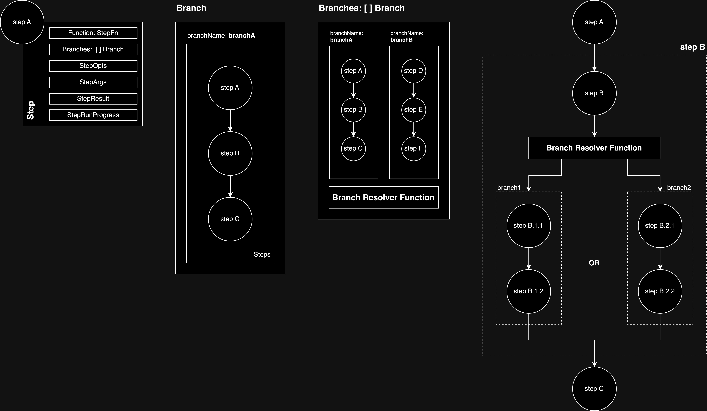

# GoSteps - `v1`

GoSteps is a go library that helps in running functions as steps and reminds you to step out and get active (kidding!).

<p align="center">
 
</p>

The idea behind `gosteps` is to define set of functions as chain-of-steps and execute them in a sequential fashion.

> [!NOTE]
> go-steps v1 is a breaking change and older v0 models wont work with the new version. For v0 documentation, examples refer to [v0.3.0-beta documentation](https://github.com/TanmoySG/go-steps/tree/v0.3.0-beta) or v0 guide [here](./v0/README.md).

## Usage

`Functions` that needs execution are defined as a `Step`, and each step is a part of a collection of multiple Steps called `Branch`, that runs sequentially. Each step can have multiple `Branches` as possible next steps, and the branch to be executed is determined based on a `ResolverFuntion` of that step.

### Installation

```bash 
go get github.com/TanmoySG/go-steps
```

### Types

Different `types` defined in GoSteps are required to create a step chain.



#### Step

The `Step` type contains the requirments to execute a step function and is a part of a Branch.

```go
type Step struct {
 Name            StepName               `json:"name"`
 Function        StepFn                 `json:"-"`
 StepOpts        StepOpts               `json:"stepConfig"`
 Branches        *Branches              `json:"branches"`
 StepArgs        map[string]interface{} `json:"stepArgs"`
 StepResult      *StepResult            `json:"stepResult"`
}
```

| Field      | Description                                                                                                |
|------------|------------------------------------------------------------------------------------------------------------|
| Name       | Name of step                                                                                               |
| Function   | The function to execute                                                                                    |
| StepOpts   | Options/Configurations of the step                                                                         |
| Branches   | Branches are a sequentially executable collection of  steps.                                               |
| StepArgs   | Any additional arguments need to pass to  the step.                                                        |
| StepResult | The results - statues of step, message returned by the step function and, errors are defined in StepResult |

**StepOpts**

The `StepOpts` type contains the configurations/options for the step execution.

```go
type StepOpts struct {
 ErrorsToRetry  []StepError   `json:"errorsToRetry"`
 RetryAllErrors bool          `json:"retryAllErrors"`
 MaxRunAttempts int           `json:"maxAttempts"`
 RetrySleep     time.Duration `json:"retrySleep"`
}

// example step
step := gosteps.Step{
  Name: "add",
  Function: Add,
  StepArgs: map[string]interface{}{"n1": 5},
  StepOpts: gosteps.StepOpts{},
  Branches: &gosteps.Branches{},
}
```

| Field          | Description                                                                                                          |
|----------------|----------------------------------------------------------------------------------------------------------------------|
| ErrorsToRetry  | a set of `StepError`s for which a step should be retried.                                                            |
| RetryAllErrors | A boolean type flag which specifies if a step needs to retry for any error, irrespective of those in `ErrorsToRetry` |
| MaxRunAttempts | Max attempts are the number of times the step is ran/executed (first run + retries). If not set, it'll run once.     |
| RetrySleep     | Sleep duration (type time.Duration) between each re-attempts                                                         |

**Function**

Defines a step function  of type  `StepFn`.

```go
// StepFn Type
type StepFn func(ctx GoStepsCtx) StepResult

// example function
func Add(ctx GoStepsCtx) StepResult {
  // do something
 return gosteps.MarkStateComplete()
}
```

#### Branch

The `Branch` type is a collection of steps that are to be executed sequentially.

```go
// Steps type - array of Step
type Steps []Step

type Branch struct {
 BranchName BranchName `json:"branchName"`
 Steps      Steps      `json:"steps"`
}

// example branch
branch := gosteps.Branch{
  BranchName: "divide",
  Steps: gosteps.Steps{
   {
    Name: "step.divide",
    Function: func(c gosteps.GoStepsCtx) gosteps.StepResult {
     // do something
     return gosteps.MarkStateComplete()
    },
   },
   { /* other steps*/ },
  },
}
```

| Field      | Description                                                                                            |
|------------|--------------------------------------------------------------------------------------------------------|
| BranchName | Name of the branch                                                                                     |
| Steps      | Steps are a collection of steps that are to be executed sequentially. It is a array of Step (`[]Step`) |

**Branches**

The `Branches` type contains an array of branch that are exececuted conditionally, and resolver function that determines the branch to be executed.

```go
type Branches struct {
 Branches []Branch   `json:"branches"`
 Resolver ResolverFn `json:"-"`
}

// example branches
branches := &gosteps.Branches{
  Resolver: ResolverFn,
  Branches: []gosteps.Branch{
   {
    BranchName: "branch1",
    Steps: gosteps.Steps{
     {
      Name:     "branch1.step1",
      Function: StepFn1,
     },
    },
   },
   {
    BranchName: "branch2",
    Steps: gosteps.Steps{
     {
      Name:     "branch2.step1",
      Function: StepFn2,
     },
    },
   },
  },
}
```

| Field    | Description                                                                                           |
|----------|-------------------------------------------------------------------------------------------------------|
| Branches | Branches are a collection of branches that are to be executed conditionally. It is an array of Branch |
| Resolver | Resolver function to determine the branch to be executed.                                             |

**ResolverFn**

The `ResolverFn` type is a function that determines the branch to be executed.

```go
// ResolverFn Type
type ResolverFn func(ctx GoStepsCtx) BranchName

// example resolver function
func nextStepResolver(ctx GoStepsCtx) BranchName {
 // do something
 return "branchName"
}
```

To see all the `types` available in go-steps see [`types.go`](./go_step_types.go)

### GoStep Context

`GoStepsCtx` is a custom context type, instance of which is passed between steps to store and share data, progress, state, etc between steps and branches.

```go
type GoStepsCtx struct {
 Data          GoStepsCtxData            `json:"data"`
 StepsProgress map[StepName]StepProgress `json:"stepsProgress"`
}

// creating a new context
ctx := gosteps.NewGoStepsContext()
```

| Field         | Description                                                                                          |
|---------------|------------------------------------------------------------------------------------------------------|
| Data          | Data is a map of key-value pairs that can be used to store and share data between steps and branches |
| StepsProgress | StepsProgress is a map of StepName and StepProgress that stores the progress of each step            |

#### GoStepCtx functions: SetData, GetData and WithData

To set data in the context, use the `SetData` method.

```go
ctx.SetData("key", "value")
```

To get data from the context, use the `GetData` method.

```go
value := ctx.GetData("key")
```

To set multiple key-value pair in the context, use the `WithData` method that expects K-V data to be of type `map[string]interface{}`.  

```go
ctx.WithData(map[string]interface{}{
 "key1": "value1",
 "key2": "value2",
})
```

These functions can be used within Step Functions and Resolver Functions to store and retrieve data and use them in the execution.

### Defining an Executable Step Chain

To define a step chain, create a Branch with the list of Steps to be run sequentially. Use the `gosteps.Steps` type or `[]gosteps.Step` type to define the steps and pass it to the `NewGoStepsRunner` method, which returns the executable step chain instance.

```go
 root := gosteps.NewGoStepsRunner(steps)
```

To execute the step chain use the `Execute` method, passing the context.

```go
 ctx := gosteps.NewGoStepsContext()
 root.Execute(ctx)
```

You can initialize GoStepsCtx with data using the `WithData` method, too.

```go
 ctx := gosteps.NewGoStepsContext().WithData(map[string]interface{}{
  "key1": "value1",
  "key2": "value2",
 })
```

### Step Function results

The step function must return a `StepResult` type, which contains the status of the step, message returned by the step function, and errors.

```go
type StepResult struct {
 StepData    GoStepsCtxData `json:"stepData"`
 StepState   StepState      `json:"stepState"`
 StepMessage *string        `json:"stepMessage"`
 StepError   *StepError     `json:"stepError,omitempty"`
}
```

GoSteps require a step function to return one of the following states.

```go
 StepStateComplete StepState = "StepStateComplete" // step completed successfully
 StepStateFailed   StepState = "StepStateFailed"   // step failed to complete, without error
 StepStateSkipped  StepState = "StepStateSkipped"  // step was skipped
 StepStatePending  StepState = "StepStatePending"  // step is pending, should be retried
 StepStateError    StepState = "StepStateError"    // step failed to complete, with error
```

Functions are defined to return the state of the step, and the message and error are optional. If the step is failed, the error should be returned.

```go
gosteps.MarkStateComplete()
gosteps.MarkStateFailed()
gosteps.MarkStateSkipped()
gosteps.MarkStatePending()
gosteps.MarkStateError()
```

In addition to the state, the step function can also return a message and error.

```go
// add data to the step result
gosteps.MarkStateComplete().WithData(map[string]interface{}{"key": value})

// add message to the step result
gosteps.MarkStateComplete().WithMessage("message")

// add error to the step result of type StepError
gosteps.MarkStateError().WithError(stepError1)

// wrap any non-GoStep StepErrors and add to the step result
// it wraps any error passed to it as StepError
gosteps.MarkStateError().WithWrappedError(fmt.Errorf("error"))
```

To define a GoStep error, use the `StepError` type.

```go
stepError1 := gosteps.StepError{
  StepErrorNameOrId: "error1",
  StepErrorMessage:  "error message",
}
```

### Conditional Branching

Some steps-chains might need to branch out conditionally, i.e run a different sets of steps based some condition. To achieve this, define the possible next Branches in the `Branches` field of the Step of type `gosteps.Branches` and pass the resolver function to the `Resolver` field.

```go
stepWithBranches := gosteps.Step{
  Name:     "stepWithBranches",
  Function: Function,
  Branches: &gosteps.Branches{
    Resolver: func(ctx gosteps.GoStepsCtx) gosteps.BranchName {
     // do something
     return gosteps.BranchName("branch1")
    },
    Branches: []gosteps.Branch{
    {
      BranchName: "branch1",
      Steps:      gosteps.Steps{ /* steps */ },
    },
    {
      BranchName: "branch2",
      Steps:      gosteps.Steps{ /* steps */ },
     },
    },
  },
}
```

If a step function is defined for the step, the resolver runs after the function is executed. If no step function is defined the resolver function runs and returns the name of the branch to be executed next.

If the resolver function returns a branch name that is not defined in the branches, the execution will move on with execution of the main branch instead of any conditional branches.

### Retrying a Step

Steps are retired if the StepState is not `StepStateComplete` or `StepStateSkipped`.

Steps are retried based for errors that are defined in `StepOpts.ErrorsToRetry` field. While steps are retried only for the stated errors, they can also be retried for any errors, irrespective of those mentioned in `ErrorsToRetry`, by setting `StepOpts.RetryAllErrors` as `true`.

The retry mechanism runs for `StepOpts.MaxRunAttempts`, that included the initial run. If a sleep duration is passed in the `StepOpts.RetrySleep`, then the step runner waits for that duration before executing the next retry of that step.

```go
gosteps.StepOpts{
  ErrorsToRetry: []gosteps.StepError{
    stepError1,
  },
  RetryAllErrors: false,
  MaxRunAttempts: 5,
  RetrySleep: 5 * time.Second,
}
```

### Example

Sample code can be found in the [example](./example/) directory.

### Help!

If you want to help fix the above constraint or other bugs/issues, feel free to raise an Issue or Pull Request with the changes. It'd be an immense help!
